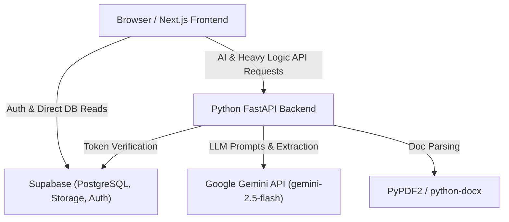

# Job Track — AI-Powered Job Tracking & Resume Analysis Platform

Job Track is a modern, full-stack web application designed to streamline the job search process. It combines application funnel tracking with intelligent, AI-assisted job description parsing and resume-to-job matching to help job seekers optimize their resumes and manage their interview pipelines effectively.

Live Application: [job-track-two-zeta.vercel.app](https://job-track-two-zeta.vercel.app)  
GitHub Repository: [github.com/rohit-sawaikar/Job-Track](https://github.com/rohit-sawaikar/Job-Track)

---

## 1. Overview

Managing job applications across multiple job boards often leads to scattered notes, forgotten follow-ups, and unoptimized resumes. **Job Track** solves this by providing a unified platform where job seekers can:
- Store and organize job listings with status tracking (Saved, Applied, Screening, Interview, Offer, Rejected, Withdrawn).
- Automatically extract structured skills, requirements, and salaries from unstructured job descriptions.
- Analyze their uploaded resumes against targeted job descriptions to receive deterministic match scores, keyword breakdown, and AI-generated tailored interview preparation suggestions.
- Manage up to 10 distinct resume versions in a private, secure workspace with inline PDF previewing.

---

## 2. Key Features

- **Authentication & Security:** Secure user authentication powered by Supabase Auth with support for Email/Password and Google OAuth. Multi-tenant Row-Level Security (RLS) ensures complete user data isolation.
- **Application Funnel Dashboard:** Real-time metrics overview displaying conversion rates across application stages, recent activity logs, and application stats.
- **AI-Powered Job Extraction:** Automatic parsing of pasted job descriptions into structured fields (Title, Company, Location, Salary, Required Skills, Preferred Skills, Work Mode, and Employment Type).
- **JD Quality Classification:** Transparent evaluation of job descriptions into *Sufficient*, *Limited*, or *Insufficient* tiers to prevent fabricated AI outputs when job descriptions are minimal or sparse.
- **Resume Workspace:** Manage multiple resume files (PDF/DOCX), set a primary resume, upload new versions, edit document names, and stream inline PDF previews directly in the browser.
- **AI Resume Match Engine:** Deterministic keyword matching combined with Google Gemini LLM reasoning to evaluate skills coverage, experience alignment, and missing competencies.
- **Duplicate Job Detection:** Real-time duplicate checking against saved job titles, company names, and application URLs to prevent redundant job entries.
- **Full Job Lifecycle Management:** Add, view, edit, update status, toggle favorites, and soft/hard delete job listings with instant UI reactivity.
- **Profile & Custom Links:** User profile customization, avatar upload, and personal career link management (e.g., Portfolio, GitHub, LinkedIn).

---

## 3. Screenshots

*(Screenshots will be captured and added prior to production showcase)*

**Recommended Screenshot Capture TODO:**
- [ ] **Dashboard Overview:** Application statistics counters and conversion funnel chart.
- [ ] **Job Tracker List:** Filterable grid/list view with status badges and search.
- [ ] **Add Job & AI Extraction:** AI job description parser with quality warning banners.
- [ ] **Resume Workspace:** Resume file list, primary badge, and inline PDF modal viewer.
- [ ] **AI Match Report:** Overall match percentage gauge, evidence breakdown, and interview prep.

---

## 4. Technology Stack

- **Frontend:** [Next.js 15](https://nextjs.org/) (App Router), React 19, TypeScript, Vanilla CSS Design System, Lucide Icons, React Hot Toast.
- **Backend:** [Python 3.11+](https://www.python.org/), [FastAPI](https://fastapi.tiangolo.com/), [Pydantic v2](https://docs.pydantic.dev/).
- **Database & Storage:** [Supabase PostgreSQL](https://supabase.com/), Supabase Storage (Private Resume Bucket), Supabase Auth.
- **AI & ML Integration:** [Google Gemini API](https://ai.google.dev/) via `google-genai` SDK (`gemini-2.5-flash`).
- **Document Processing:** `PyPDF2`, `python-docx` for backend document extraction.
- **Deployment:** Vercel (Next.js & Serverless FastAPI backend integration).

---

## 5. System Architecture

Job Track utilizes a decoupled architecture where Next.js handles server rendering and client interaction, while FastAPI acts as an API gateway for heavy document extraction, AI processing, and Pydantic validation.



---

## 6. How AI is Used

Job Track distinguishes between **deterministic rule-based processing** and **generative LLM reasoning** to ensure maximum precision and accuracy:

1. **Job Description Extraction:**
   - Evaluates input quality before processing (word count, keyword density).
   - If input is sparse (e.g., "Python dev needed"), the system returns an *Insufficient* quality notice and avoids hallucinating company names, salary, or responsibilities.
   - Extracts structured technical skills, salary ranges, and experience using structured Gemini JSON schemas.

2. **Resume Parsing & Matching Engine:**
   - **Deterministic Extraction:** Text is extracted from PDF/DOCX files locally using PyPDF2 / python-docx. Technical skills are normalized against a canonical skills library.
   - **Deterministic Scoring:** Hard skills coverage and direct keyword overlap are scored using standard set intersections.
   - **Generative Insights:** Gemini provides qualitative hero summary synthesis and tailored interview preparation questions based solely on explicit resume evidence.

---

## 7. Local Setup Instructions

### Prerequisites
- [Node.js 18+](https://nodejs.org/)
- [Python 3.11+](https://www.python.org/)
- [Git](https://git-scm.com/)

### 1. Clone the Repository
```powershell
git clone https://github.com/rohit-sawaikar/Job-Track.git
cd Job-Track
```

### 2. Frontend Setup (Next.js)
```powershell
npm install
```

### 3. Backend Setup (Python)
```powershell
# Create and activate virtual environment
python -m venv .venv
.\.venv\Scripts\Activate.ps1

# Install Python dependencies
pip install -r backend/requirements.txt
```

### 4. Environment Variables
Copy `.env.example` to `.env.local` (for Next.js) and `.env` (for FastAPI backend):
```powershell
Copy-Item .env.example .env.local
Copy-Item .env.example .env
```
*(Fill in your local Supabase credentials and Gemini API Key as described in Section 8).*

### 5. Run Development Servers
Start FastAPI Backend (Terminal 1):
```powershell
$env:PYTHONPATH="backend"
uvicorn app.main:app --reload --port 8000
```

Start Next.js Frontend (Terminal 2):
```powershell
npm run dev
```
Open `http://localhost:3000` in your browser.

---

## 8. Environment Variables

Below is the required environment configuration template:

| Variable | Scope | Description |
|---|---|---|
| `NEXT_PUBLIC_SUPABASE_URL` | Frontend | Public Supabase project URL |
| `NEXT_PUBLIC_SUPABASE_ANON_KEY` | Frontend | Public Supabase anonymous API key |
| `SUPABASE_URL` | Backend | Supabase API endpoint for server-side client |
| `SUPABASE_SERVICE_ROLE_KEY` | Backend | Privileged Supabase key for admin storage operations |
| `SUPABASE_JWT_SECRET` | Backend | Secret used to verify and decode user JWTs |
| `GEMINI_API_KEY` | Backend | Google Gemini API Key |
| `PYTHON_BACKEND_URL` | Frontend | URL of FastAPI server (e.g. `http://127.0.0.1:8000`) |

*(Refer to `.env.example` for the full annotated configuration template).*

---

## 9. Database Setup

Database tables and Row Level Security (RLS) policies are managed via Supabase SQL migrations located in `supabase/migrations/`:

1. `01_schema.sql` — Initializes `profiles`, `jobs`, `resumes`, `job_analyses`, `custom_links`, and `activity_logs` tables.
2. `02_storage_setup.sql` — Configures private `resumes` and `avatars` storage buckets with RLS file access policies.
3. `03_row_level_security.sql` — Enforces strict user ownership (`auth.uid() = user_id`) on all CRUD queries.

To apply migrations manually in the Supabase SQL Editor, run the migration files in numerical order (`01` -> `02` -> `03`).

---

## 10. Testing

Job Track includes Python unit tests covering JWT validation, job lifecycle edge cases, matching engine precision, evidence sanitization, and user isolation security.

### Run Python Backend Tests
```powershell
$env:PYTHONPATH="backend"
python -m unittest discover -s tests -p "test_*.py"
```

### Run Frontend Type Check
```powershell
npx tsc --noEmit
```

---

## 11. Deployment

- **Frontend & Serverless Backend:** Deployed on **Vercel**. FastAPI backend is integrated into Vercel Serverless Functions under `/api/py/`.
- **Database & Storage:** Hosted on **Supabase Free Tier**.
- **Cold Starts:** Serverless Python functions on Vercel may experience a ~1-2s cold start latency on initial requests.

---

## 12. Security & Privacy

- **Authentication & JWT Verification:** Requests to FastAPI endpoints require valid Supabase JWT tokens. JWT signatures are verified server-side.
- **Row-Level Security (RLS):** All database reads/writes check `auth.uid() = user_id`.
- **Private Document Storage:** Resume files stored in Supabase Storage are private by default. In-browser PDF previews stream through an authenticated backend proxy with `Content-Disposition: inline`.
- **No Secret Exposure:** Privileged keys (`SUPABASE_SERVICE_ROLE_KEY`, `SUPABASE_JWT_SECRET`, `GEMINI_API_KEY`) are kept exclusively on the server backend.

---

## 13. Known Limitations

- **File Formats:** Resume analysis supports standard `.pdf` and `.docx` text formats. Scanned image-only PDFs require OCR preprocessing before parsing.
- **Web Scraping:** Job extraction relies on text pasted directly by the user rather than automated live URL scraping to avoid paywalls and anti-bot measures.

---

## 14. License

This project is open for demonstration and educational purposes. See the repository repository root for licensing details if applicable.
